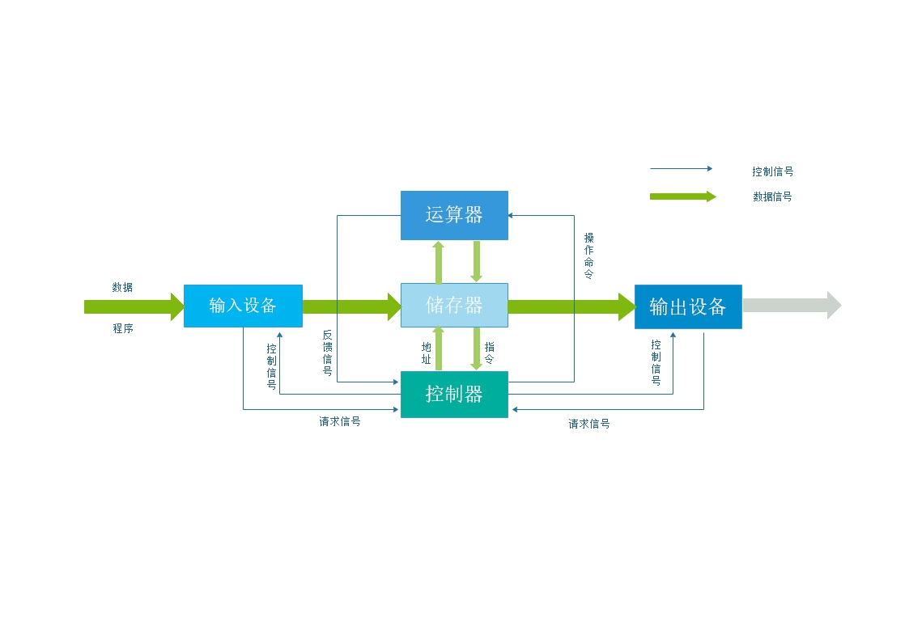
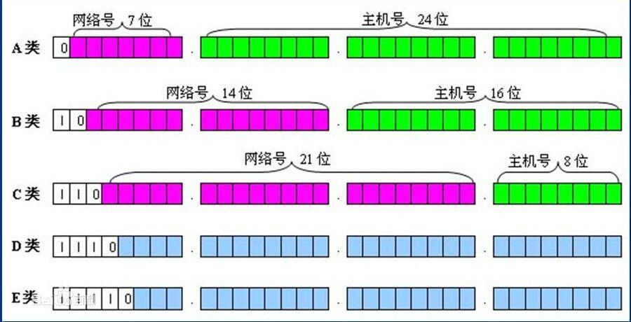
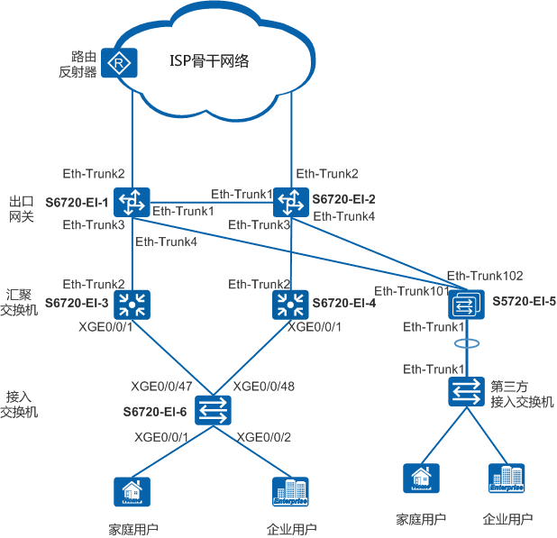

# 1.现代计算机基础
## 1.1 计算机架构   
计算机架构也可以理解为CPU架构。它是依据指令集的不同来划分的。指令集分为精简指令集（RISC）和复杂指令集（CISC），它们的区别是指令的数目多少和指令的长度是否相等，这也是造成它们不同的根本区别。
### 1.1.1 X86  
&emsp;&emsp;泛指一系列由Intel公司开发处理器的架构。它使用可变指令长度的CISC（复杂指令集）。它的设计是为超高性能的台式机和服务器处理器。优势：性能高。缺点：功耗也高。
### 1.1.2 AMD  
&emsp;&emsp;是由AMD公司开发的，是目前唯一可同Intel匹敌的CPU厂商，该CPU使用固定长度的RISC（精简指令集）。优势：功耗低。缺点：乱序执行比X86低。适用于移动设备。    
  
  
## 1.2 硬件组成  
__计算机硬件基本组成 五大部件:运算器、控制器、存储器、输入设备、输出设备。__
 >运算器  
&emsp; 又称算数逻辑单元（ALU）,是进行算数、逻辑运算的部件。主要作用是执行各种算术，逻辑运算和对数据进行加工处理。

 >控制器  
&emsp;是对输入的指令进行分析，并统一控制计算机各部件完成一定任务的部件。一般由指令寄存器、状态寄存器、指令译码器、时序电路和控制电路组成。是协调指挥各部件工作的原件。

>存储器  
&emsp;是计算机记忆或暂存数据的部件。分为内存储器（内存）和外存储器（硬盘）。

>输入设备  
&emsp;重要的人机接口，用来接收用户输入的原始数据和程序，并将它们变为机器能识别的二进制存入到内存中。常见的有：键盘、鼠标等。

>输出设备  
&emsp;  输出计算机处理结果的设备，用于将存入在内存中的由计算机处理的结果转变为人们能接受的形式输出。常见的有显示器、打印机等。 

*运算器、控制器和寄存器等硬件组成了硬件系统的核心--中央处理器__（CPU）__  
输入设备和输出设备我们统称为 __I/O设备__  
图形处理器__（GPU）__，在以前很少被视为一个单独的运算单元。它可以使显卡减少对中央处理器的依赖，并分担由部分原来是中央处理器（CPU）所承担的工作，尤其是在进行三维绘图运算时，功效更加明显。  
供电单元__（PSU)__ 也就是通常说的电源适配器。  
内存储器__（RAM)__通俗叫内存条&emsp;&emsp;&emsp;外存储器有机械硬盘__（HDD)__和固态硬盘__（SSD)__*

## 1.3 工作原理  
   
  
 
# 2.计算机网络基础
## 2.1 OSI七层模型
| OSI网络模型 | 作用 | 层数 |                  对应协议    |
|---------            |----                 |----|----|-----|
| 应用层              |  应用程序间通讯      |  第七层      |HTTP(超文本传输)，FTP（文件传输），TFTP（简单文本传输），NFS（网络文件系统）
| 表示层              |  格式转换 ，数据加密  |   第六层     |TELNET(虚拟终端)，SNMP（简单网络管理）
| 会话层              | 建立管理维护会话      |  第五层      |SMTP（简单邮件传输），DNS（域名解析）
| 传输层              | 提供端到端通讯        | 第四层       |TCP（可靠传输），UTP（不可靠传输）
| 网络层              | 地址路由选择          |  第三层      |IP（网际协议），ARP（地址解析协议）,RARP（反地址解析协议）
| 数据链路层          |  传送和识别数据帧      |  第二层      |PPP（点对点协议），FDDI，SLIP（串行线路接口协议）
| 物理层              |   比特流传输          |   第一层     |  IEEE 802.1A，IEEE 802.2到IEEE 802.11
__OSI模型在协议开发前设计，具有通用性。是理论上的模型，没有成熟的产品__
## 2.2 TCP/IP四层模型
| TCP/IP网络模型 | 关联 | 层数 |                      
|---------            |----                               |----|----|
| 应用层              |  与OSI网络上3层对应                 | 第四层       |
| 传输层              |  与OSI传输层对应                    |  第三层      |
| 国际互联层          |  与OSI网络层对应                    |  第二层      |
| 网络接口层           |  与OSI物理层和数据链路层对应        |   第一层     |  
__TCP/IP是先有协议集然后建立的模型，不适用于非TCP/IP网络。现是国际标准__
## 2.3 IP  
互联网协议地址缩写为__IP地址__，是分配给用户上网使用的网际协议的设备的数字标签。常见的IP地址分为IPV4和IPV6两大类，但也有其他不常用小分类。  
按照TCP/IP（Transport Control Protocol/Internet Protocol，传输控制协议/Internet协议）协议规定，IP地址用二进制来表示，每个IP地址长32bit，比特换算成字节，就是4个字节。例如一个采用二进制形式的IP地址是一串很长的数字，人们处理起来也太费劲了。为了方便人们的使用，IP地址经常被写成十进制的形式，中间使用符号“.”分开不同的字节。比如：192.168.1.1 。IP地址的这种表示法叫做“点分十进制表示法”，这显然比1和0容易记忆得多。  
地址格式为：IP地址=网络地址+主机地址或 IP地址=网络地址+子网地址+主机地址。  
__网络号:用于识别主机所在的网络__  
__主机号：用于识别该网络中的主机__   
IP地址分为五类，A类保留给政府机构，B类分配给中等规模的公司，C类分配给任何需要的人，D类用于组播，E类用于实验，各类可容纳的地址数目不同。  
 

## 2.4 子网掩码  
为了标识IP地址的网络部分和主机部分，要和__子网掩码__结合，掩码跟IP地址一样也是32 bits，用点分十进制表示。IP地址网络部分对应的掩码部分全为“1”，主机部分对应的掩码全为“0”。
缺省状态下，如果没有进行子网划分，A类网络的子网掩码为255.0.0.0，B类网络的子网掩码为255.255.0.0，C类网络的子网掩码为255.255.255.0。利用子网，网络地址的使用会更加有效。
有了子网掩码后，IP地址的标识方法如下：
例：192.168.1.1 255.255.255.0或者标识成192.168.1.1/24（掩码中“1”的个数）  
A类网络默认子网掩码是255.0.0.0，用CIDR表示为/8  
B类网络默认子网掩码为255.255.0.0.0，用CIDR表示为/16  
C类网络默认子网掩码为255.255.255.0，用CIDR表示为/24

## 2.5 子网划分  
子网划分是通过借用IP地址中若干位主机地址来充当子网的网络地址，从而将原网络划分为若干子网。
划分子网时，随着子网地址借用主机位数的增多，子网的数目随之增加，但每个子网中的可用主机数逐渐减少。
如C类地址，原有8位主机位，2^8-2即254个主机地址，默认子网掩码255.255.255.0。(全0或全1不可用）
借用1位主机位，产生2^1-2=0个子网，每个子网有2^7个主机地址；
借用2位主机位，产生2^2-2=2个子网，每个子网有2^6个主机地址;……
根据子网ID借用的主机位数，我们可以计算出划分的子网数、掩码、每个子网主机数。

## 2.6 网络数通设备
### 2.6.1 交换机  
- 交换机，是一个扩大网络的器材，能为子网络中提供更多的连接端口，以便连接更多的计算机。随着通信业的发展以及国民经济信息化的推进，网络交换机市场呈稳步上升态势。它具有性能价格比高、高度灵活、相对简单、易于实现等特点。所以，以太网技术已成为当今最重要的一种局域网组网技术，网络交换机也就成为了最普及的交换机。

  交换机工作在OSI模型中的第二层（数据链路层），依赖于MAC地址（设备的唯一标识）的识别。

### 2.6.2 路由器  
- 路由器(Router)，是连接因特网中各局域网、广域网的设备，它会根据信道的情况自动选择和设定路由，以最佳路径，按前后顺序发送信号。路由器是互联网络的枢纽，"交通警察"。目前路由器已经广泛应用于各行各业，各种不同档次的产品已成为实现各种骨干网内部连接、骨干网间互联和骨干网与互联网互联互通业务的主力军。

    路由器工作在OSI模型中的第三层（网络层），通过IP协议进行不同网络之间的通行。  

 **__区别__**  
            
            
  路由和交换机之间的主要区别就是交换机发生在OSI参考模型第二层(数据链路层)，而路由发生在第三层，即网络层。这一区别决定了路由和交换机在移动信息的过程中需使用不同的控制信息，所以说两者实现各自功能的方式是不同的。

## ~~2.7 现代网络部署方案~~  
~~举例:  [华为](https://support.huawei.com/enterprise/zh/doc/EDOC1100023156)~~  
 
# 3.虚拟化
## 3.1 什么是虚拟化  
>虚拟化，是指通过虚拟化技术将一台计算机虚拟为多台逻辑计算机。在一台计算机上同时运行多个逻辑计算机，每个逻辑计算机可运行不同的操作系统，并且应用程序都可以在相互独立的空间内运行而互不影响，从而显著提高计算机的工作效率。

 __虚拟化使用软件的方法重新定义划分IT资源，可以实现IT资源的动态分配、灵活调度、跨域共享，提高IT资源利用率，使IT资源能够真正成为社会基础设施，服务于各行各业中灵活多变的应用需求。__ 

## 3.2 Hypervisor是什么  
>Hypervisor一种运行在基础物理服务器和操作系统之间的中间软件层，可允许多个操作系统和应用共享硬件。也可叫做VMM( virtual machine monitor )，即虚拟机监视器。

__Hypervisor是一种在虚拟环境中的“元”操作系统。他们可以访问服务器上包括磁盘和内存在内的所有物理设备。Hypervisor不但协调着这些硬件资源的访问，也同时在各个虚拟机之间施加防护。当服务器启动并执行Hypervisor时，它会加载所有虚拟机客户端的操作系统同时会分配给每一台虚拟机适量的内存，CPU，网络和磁盘。__

## 3.3 虚拟化分类
### 3.3.1 全虚拟化  
>全虚拟化(FV)  
&ensp;&emsp;不需要对安装在虚拟机上的操作系统（GuestOS）的源码进行修改就可以运行在vmm中。在虚拟化平台中GuestOS并不知道自己是一台虚拟机，把自己当成是直接安装在硬件设备上的操作系统。因为全虚拟化的Vmm会将一个OS所能操控的CPU 、内存 、外设等都逻辑抽象成全新的虚拟CPU、内存、外设，来给GuestOS使用。这些都是Vmm虚拟给GusetOS的。GuestOS的指令全都需要VMM进行捕获-翻译-模拟。 
### 3.3.2 半虚拟化  
>半虚拟化（PV）  
&ensp;&emsp; 需要对GuestOS的内核代码做一定的修改，才能将GuestOS运行在半虚拟化的VMM中。半虚拟化通过在GuestOS的源码级别上的修改来避免VMM把GuestOS的指令全部捕获 -翻译-模拟，而是把一些原来在物理机上执行的特权指令修改为可以和Vmm直接交互的方式。这样会减少性能损耗。所以半虚拟化的性能要高于全虚拟化。但是系统镜像并不通用。
### 3.3.3 硬件辅助虚拟化  
>硬件辅助虚拟化  
&ensp;&emsp;随着CPU硬件的发展开始通过硬件来支持虚拟化技术。比如Intal vt-x 和AMD -v 它们通过硬件手段使得GuestOS和HostOS都可以直接运行CPU的特权指令了。这是cpu的硬件辅助虚拟化，还有I/O穿透等等。它们都是基于硬件的改变来支持的，都需要调整处理器的架构。  

__比较__  
&ensp;&emsp;FV无需更改任何东西，性能较低。  
&ensp;&emsp;PV更改GuestOS的内核，性能高于FV。  
&ensp;&emsp;硬件辅助虚拟化CPU架构的调整，硬件修改。  

___图解___  

## 3.4 虚拟化技术  
虚拟化技术指的是软件层面的实现虚拟化的技术，整体上分为开源虚拟化和商业虚拟化两大阵营。典型的代表有：Xen，KVM，WMware，Hyper-V、Docker容器等。

Xen和KVM，是开源免费的虚拟化软件;WMware是付费的虚拟化软件;Hyper-V微软的收费虚拟化技术;Docker是一种容器技术，属于一种轻量级虚拟化技术。

虚拟化软件产品有很多，无论是开源还是商业的，上面只是列举了很少的几款，每款软件产品有其优缺点以及应用场景，需要根据业务场景选择，下面简单介绍一下KVM和Xen。

1. KVM(Kernel-based Virtual Machine)基于内核的虚拟

KVM是集成到Linux内核的Hypervisor，是X86架构且硬件支持虚拟化技术(Intel VT或AMD-V)的Linux的全虚拟化解决方案。它是Linux的一个很小的模块，利用Linux做大量的事，如任务调度、内存管理与硬件设备交互等。  

2. Xen  

Xen是第一类运行在裸机上的虚拟化管理程序(Hypervisor)。它支持全虚拟化和准虚拟化，Xen支持hypervisor和虚拟机互相通讯，而且提供在所有Linux版本上的免费产品，包括Red Hat Enterprise Linux和SUSE Linux Enterprise Server。

Xen最重要的优势在于准虚拟化，此外未经修改的操作系统也可以直接在Xen上运行(如Windows)，能让虚拟机有效运行而不需要仿真，因此虚拟机能感知到Hypervisor，而不需要模拟虚拟硬件，从而能实现高性能。

# 4.云计算  
## 4.1 什么是云计算  
现阶段广为接受的是美国国家标准与技术研究院（NIST）定义：  
>云计算是一种按使用量付费的模式，这种模式提供可用的、便捷的、按需的网络访问， 进入可配置的计算资源共享池（资源包括网络，服务器，存储，应用软件，服务），这些资源能够被快速提供，只需投入很少的管理工作，或与服务供应商进行很少的交互。

__云计算最基本的特性是：“按使用量付费”、“资源共享池”和多租户隔离。__

## 4.2 云计算的基本组成  
   * 物理架构层：供电、散热
   * 基础IT架构层：包括网络、存储、服务器等。它们会组成一个集群，并搭载虚拟化，进行自动化管理
   * 基础架构/集群管理层：部署在集群上面的虚拟化层来增加系统的弹性
   * 资源部署层：作为一个管理和驱动集群的角色
   * 中间件层：应用层与资源层需要一个中间件来适配，这就是中间层
   * 应用引擎层：提供一个通用的业务开发平台，可以实现统一发布
   * 业务展现于运营层： 把服务提供给用户使用，需要一个业务展示界面。
   
   
## 4.3 云计算的分类
### 4.3.1 公有云  
>公有云是部署云计算最常见的方式。公有云资源（如服务器和存储空间）由第三方云服务提供商拥有和运营，这些资源通过 Internet 提供。Microsoft Azure 是公有云的一个示例。在公有云中，所有硬件、软件和其他支持性基础结构均为云提供商所拥有和管理。在公有云中，你与其他组织或云“租户”共享相同的硬件、存储和网络设备。 你可以使用 Web 浏览器访问服务和管理帐户。公有云部署通常用于提供基于 Web 的电子邮件、网上办公应用、存储以及测试和开发环境。

__公有云优势__：
* 成本更低 — 无需购买硬件或软件，仅对使用的服务付费。
* 无需维护 — 维护由服务提供商提供。
* 近乎无限制的缩放性 — 提供按需资源，可满足业务需求。
* 高可靠性 — 具备众多服务器，确保免受故障影响
### 4.3.2 私有云  
>私有云由专供一个企业或组织使用的云计算资源构成。私有云可在物理上位于组织的现场数据中心，也可由第三方服务提供商托管。但是，在私有云中，服务和基础结构始终在私有网络上进行维护，硬件和软件专供组织使用。这样，私有云可使组织更加方便地自定义资源，从而满足特定的 IT 需求。私有云的使用对象通常为政府机构、金融机构以及其他具备业务关键性运营且希望对环境拥有更大控制权的中型到大型组织。

__私有云优势：__
* 灵活性更高 — 组织可自定义云环境以满足特定业务需求。
* 安全性更高 — 资源不与其他组织共享，从而可实现更高控制性和安全性级别。
* 缩放性更高 — 私有云仍然具有公有云的缩放性和效率。
### 4.3.3 混合云  
>混合云通常被认为是“两全其美”，它将本地基础架构或私有云与公有云相结合，组织可利用这两者的优势。在混合云中，数据和应用程序可在私有云和公有云之间移动，从而可提供更大灵活性和更多部署选项。例如，对于基于 Web 的电子邮件等大批量和低安全性需求可使用公有云，对于财务报表等敏感性和业务关键型运作可使用私有云（或其他本地基础架构）。在混合云中，还可选择“云爆发”。应用程序或资源在私有云中运行出现需求峰值（例如网络购物或报税等季节性事件）时可选择“云爆发”，此时组织可“冲破”至公有云以使用其他计算资源。

__混合云优势：__
* 控制性 — 组织可针对敏感资产维持私有基础结构。
* 灵活性 — 需要时可利用公有云中的其他资源。
* 成本效益 — 具备扩展至公有云的能力，因此可仅在需要时支付额外的计算能力。
* 容易轻松 — 无需费时费力即可转换至云，因为可根据时间按工作负荷逐步迁移。
## 4.4 服务形式
### 4.4.1 基础设施即服务（IaaS）  
  基础设施即服务(IaaS)：所谓基础设施指的是云系统中的硬件设施如服务器、网络、存储。所以IaaS只是提供硬件平台，具体的计算任务由用户自行部署。

### 4.4.2 平台即服务（PaaS）  
  平台即服务：相对于IaaS，PaaS屏蔽而不出租基础架构，转而出租更高一层的软件平台。用户可以通过这个平台制作应用。因为这个平台是一种运行与硬件集群中的软件，用户实际上相当于租用了计算业务。  
### 4.4.3 软件即服务（SaaS）   
  软件即服务：SaaS是云服务中的最外层，直接出售业务级别的内容。比如Web网页等。

__云本质是一种服务，是一种方式和方法，而不是某种设备，某个软件，当然云需要由硬件+软件来承载而已。所以，云和速度性能没有直接关系，它的主要目的是廉价高效的利用资源并降低硬件的应用成本和管理成本。云不一定就是一个高速高冗余的东西，而是说底层硬件一般使用并行计算集群和存储集群，在这个基础上，云才能表现出更大的效能。__
## 4.5 云计算的应用场景  
### 4.5.1 IDC云  
IDC云是在IDC原有数据中心的基础上，加入更多云的基因，比如系统虚拟化技术、自动化管理技术和智慧的能源监控技术等。通过IDC的云平台，用户能够使用到虚拟机和存储等资源。还有，IDC可通过引入新的云技术来提供许多新的具有一定附加值的服务，比如，Paas等。现在已成型的IDC云有Linode和Rackspace等。
### 4.5.2 企业云  
企业云对于那些需要提升内部数据中心的运维水平和希望能使整个IT服务更围绕业务展开的大中型企业非常适合。相关的产品和解决方案有IBM的WebSphereCloudBurst Appliance、Cisco的UCS和VWware的vSphere等。
### 4.5.3 云存储系统  
云存储系统可以解决本地存储在管理上的缺失，降低数据的丢失率，它通过整合网络中多种存储设备来对外提供云存储服务，并能管理数据的存储、备份、复制和存档，云存储系统非常适合那些需要管理和存储海量数据的企业。
### 4.5.4 虚拟桌面云  
虚拟桌面云可以解决传统桌面系统成本高的问题，其利用了现在成熟的桌面虚拟化技术，更加稳定和灵活，而且系统管理员可以统一的管理用户在服务器端的桌面环境，该技术比较适合那些需要使用大量桌面系统的企业。
### 4.5.5 开发测试云  
开发测试云可以解决开发测试过程中的棘手问题，其通过有好的Web界面，可以预约、部署、管理和回收整个开发测试的环境，通过预先配置好（包括操作系统，中间件和开发测试软件）的虚拟镜像来快速地构建一个个异构的开发测试环境，通过快速的备份/恢复等虚拟化技术来重现问题，并利用云的强大的计算能力来对应用进行压力测试，比较适合哪些需要开发和测试多种应用的组织和企业。
### 4.5.6 大规模数据处理云  
大规模数据处理云能对海量的数据进行大规模的处理，可以帮助企业快速地进行数据分析，发现可能存在的商机和存在的问题，从而做出更好、更快和更全面的决策。其工作过程是大规模数据处理云通过将数据处理软件和服务运行在云计算平台上，利用云计算的计算能力和存储能力对海量的数据进行大规模的处理。
### 4.5.7 协作云  
协作云是云供应商在IDC云基础上或者直接构建一个专属的云，并在这个云搭建整套的协作软件，并将这些软件共享给用户，非常适合那些需要一定的协作工具，但不希望维护相关的软硬件和支付高昂的软件许可证费用的企业和个人。
### 4.5.8 游戏云  
游戏云是将游戏部署至云中的技术，目前主要有两种应用模式，一种是基于Web游戏模式，比如使用JavaScript、Flash和SilverLight等技术，并将这些游戏部署到云中，这种解决方案比较适合休闲游戏；另一种是为大容量和高画质的专业游戏设计的，整个游戏都将在云中运行，但会将最新生成的画面传至客户端，比较适合专业玩家。
### 4.5.9 HPC云  
HPC云能够为用户提供可以完全定制的高性能计算机环境，用户可以根据自己的需求来改变计算机环境的操作系统、软件版本和节点规模。从而避免与其他用户的冲突，并可以成为网络计算的支撑平台，以提升计算机的灵活性和便携性。HPC云特别适合需要使用高性能计算，但缺乏巨资投入的普通企业和学校。
### 4.5.10 云杀毒   
云杀毒技术可以在云中安装附带庞大的病毒特征库的杀毒软件，当发现有嫌疑的数据时，杀毒软件可以将有嫌疑的数据上传至云中，并通过云中庞大的特征库和强大的处理能力来分析这个数据是否含有这个病毒，这非常适合哪些需要使用杀毒软件来捍卫其电脑安全的用户。
