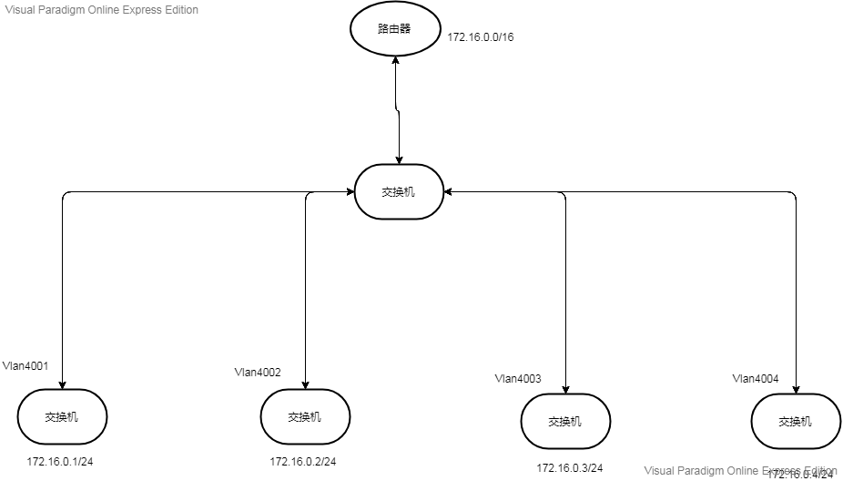
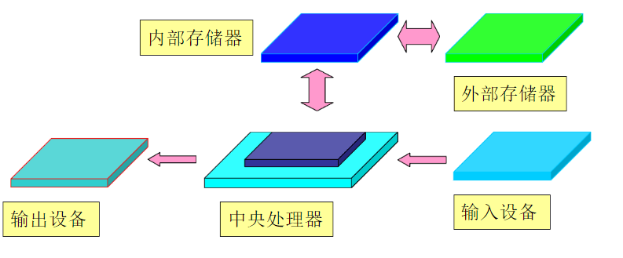
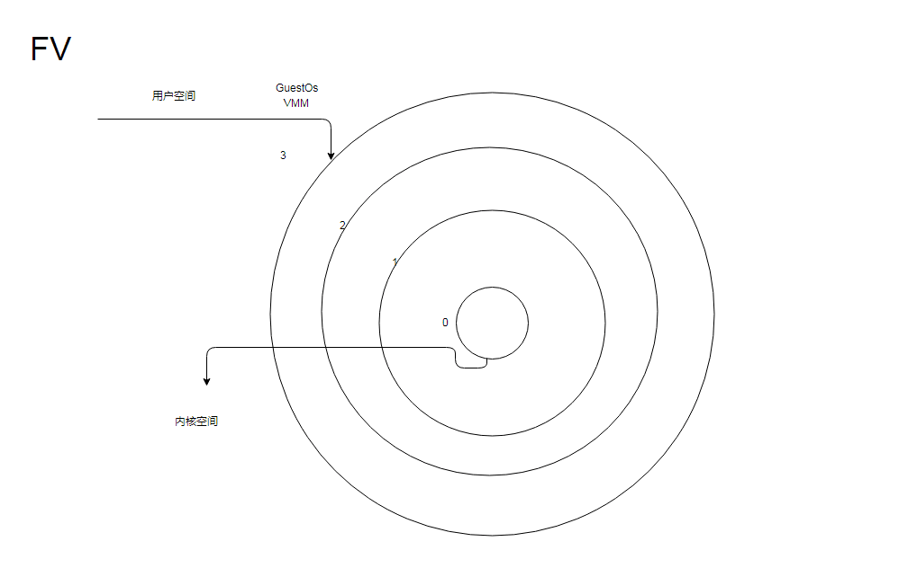
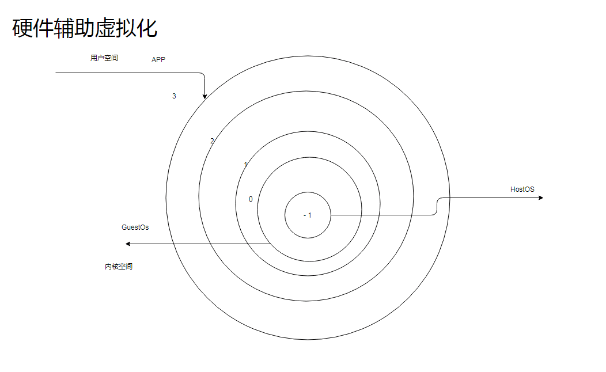

# 1. OSI网络参考模型采用几层体系设计。

| OSI网络模型 | 关联 | 层数 |                      
|---------            |----                 |----|----|
| 应用层              |  应用程序间通讯      |  第七层      |
| 表示层              |  格式转换 ，数据加密  |   第六层     |
| 会话层              | 建立管理维护会话      |  第五层      |
| 传输层              | 提供端到端通讯        | 第四层       |
| 网络层              | 地址路由选择          |  第三层      |
| 数据链路层          |  传送和识别数据帧      |  第二层      |
| 物理层              |   比特流传输          |   第一层     |

 # 2.子网掩码的作用是什么。
子网掩码是用来指明一个ip地址的哪些位标识的是主机所在的子网，以及哪些位标识的是主机的位掩码。
它不能单独存在，必须和IP地址一起使用。它是一个32位地址，和ip一样（2进制）。

__它的作用主要有俩个:__  
&emsp;&emsp;一:用于屏蔽IP地址的一部分以区别网络标识和主机标识，说明该ip是存在局域网上的还是远程网上的。  
&emsp;&emsp;二:用于将一个大的IP网络划分为若干小的子网络。使用子网络是为了减少ip的浪费，提高网络应用的效率。

# 3.简述交换机和路由器的区别，两者在OSI模型中工作在哪一层。
- 交换机：连接计算机、服务器、网络打印机、网络摄像头、IP电话等终端设备，并实现他们与其他交换机、无线接入点、路由器、网络防火墙等网络设备的互联，从而构建局域网络，实现设备之间的互联。

  交换机工作在OSI模型中的第二层（数据链路层），依赖于MAC地址（设备的唯一标识）的识别。

- 路由器：连接多个网络或网络段的网络设备，它将不同的网络或网络段之间的数据进行“翻译”，是它们能相互“读”懂对方的数据，从而构成一个更大的网络。它的主要功能是连通不同的网络和信息的传输。

    路由器工作在OSI模型中的第三层（网络层），通过IP协议进行不同网络之间的通行。

**__不同__**

&emsp;&emsp;&emsp;-工作层次不同

&emsp;&emsp;&emsp;-数据转发依赖的对象不同&emsp;

&emsp;&emsp;&emsp;-传统交换机只能分割冲突域，不能分割广播域（交换机连接的网段仍是同一个广播域，广播数据会在交换机连接的所有网段上传播；路由器上的网段会被分配成不同的广播域，广播数据不会穿过路由器。）

&emsp;&emsp;&emsp;-路由器提供了防火墙的服务

# 4.学校A需要新建一个局域网，现有48口交换机5台，路由器1台，IP地址已经规划范围为172.16.0.0/16.学校共有4栋教学楼，核心机房一个，互联网专线已接入核心机房，4栋教学楼的网络要进行VLAN隔离，VLAN ID分别为4001、4002、4003、4004.学校需要接入互联网。画出网络拓扑图，并简述。  
__为每个VLAN分配IP段 ，IP不同。__

 # 5.简述现代X86架构计算机的硬件架构组成，可画图辅助。
 ## 计算机硬件基本组成五大部件:运算器、控制器、存储器、输入设备、输出设备。
 >运算器  
&emsp; 又称算数逻辑单元（ALU）,是进行算数、逻辑运算的部件。主要作用是执行各种算术，逻辑运算和对数据进行加工处理。

 >控制器  
&emsp;是对输入的指令进行分析，并统一控制计算机各部件完成一定任务的部件。一般由指令寄存器、状态寄存器、指令译码器、时序电路和控制电路组成。是协调指挥各部件工作的原件。

>存储器  
&emsp;是计算机记忆或暂存数据的部件。分为内存储器（内存）和外存储器（硬盘）。

>输入设备  
&emsp;重要的人机接口，用来接收用户输入的原始数据和程序，并将它们变为机器能识别的二进制存入到内存中。常见的有：键盘、鼠标等。

>输出设备
&emsp;输出计算机处理结果的设备，用于将存入在内存中的由计算机处理的结果转变为人们能接受的形式输出。常见的有显示器、打印机等。

*运算器、控制器和寄存器等硬件组成了硬件系统的核心--中央处理器（CPU）  
输入设备和输出设备我们统称为I/O设备  
我们的计算机系统还有图形处理器（GPU），在以前很少被视为一个单独的运算单元。它可以使显卡减少对中央处理器的依赖，并分担由部分原来是中央处理器（CPU）所承担的工作，尤其是在进行三维绘图运算时，功效更加明显。  
当然我们系统的运行需要供电那就还有 我们的供电单元（PSU)也就是通常说的电源适配器。*

他们的工作流程可以这样简单的理解：
  

__X86架构__  
&ensp;&emsp;是CPU的一种架构。CPU的两大架构为：ARM和X86。ARM使用精简指令集（RISC）  X86使用复杂指令集（CISC）
 ARM架构的代表ARM处理器  ；    X86架构的代表Intel处理器。它们各有优缺点：arm处理器功耗低；x86性能高。

 # 6.简述全虚拟化、半虚拟化、硬件辅助虚拟化的区别，可画图辅助。

>全虚拟化(FV)  
&ensp;&emsp;不需要对安装在虚拟机上的操作系统（GuestOS）的源码进行修改就可以运行在vmm中。在虚拟化平台中GuestOS并不知道自己是一台虚拟机，把自己当成是直接安装在硬件设备上的操作系统。因为全虚拟化的Vmm会将一个OS所能操控的CPU 、内存 、外设等都逻辑抽象成全新的虚拟CPU、内存、外设，来给GuestOS使用。这些都是Vmm虚拟给GusetOS的。GuestOS的指令全都需要VMM进行捕获-翻译-模拟。  

>半虚拟化（PV）  
&ensp;&emsp; 需要对GuestOS的内核代码做一定的修改，才能将GuestOS运行在半虚拟化的VMM中。半虚拟化通过在GuestOS的源码级别上的修改来避免VMM把GuestOS的指令全部捕获 -翻译-模拟，而是把一些原来在物理机上执行的特权指令修改为可以和Vmm直接交互的方式。这样会减少性能损耗。所以半虚拟化的性能要高于全虚拟化。但是系统镜像并不通用。

>硬件辅助虚拟化  
&ensp;&emsp;随着CPU硬件的发展开始通过硬件来支持虚拟化技术。比如Intal vt-x 和AMD -v 它们通过硬件手段使得GuestOS和HostOS都可以直接运行CPU的特权指令了。这是cpu的硬件辅助虚拟化，还有I/O穿透等等。它们都是基于硬件的改变来支持的，都需要调整处理器的架构。

__比较__  
&ensp;&emsp;FV无需更改任何东西，性能较低。  
&ensp;&emsp;PV更改GuestOS的内核，性能高于FV。  
&ensp;&emsp;硬件辅助虚拟化CPU架构的调整，硬件修改。

